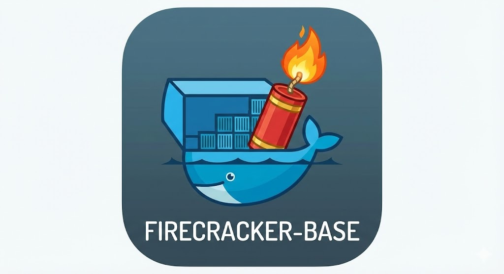

<div style="text-align: center;">
  <p>amd64✅ - arm64⚠️</p>
  <p><a href="https://deepwiki.com/BechtelCanDoIt/firecracker-base"></a></p>  
</div>

---

# Firecracker-Base: Hardware-Isolated Docker Environment For AI Agents

<div style="text-align: center;">
  
</div>

Run Docker containers inside a [Firecracker MicroVM](https://firecracker-microvm.github.io/) for maximum security isolation.

This project is needed in order to run Firecracker inside of Docker on the host machine. And then in turn run a seperate Docker instance in the guest machine of the VM.

```
┌─────────────────────────────────────────────────────────────┐
│  Host System                                                │
│  ┌───────────────────────────────────────────────────────┐  │
│  │  Host Docker Engine                                   │  │
│  │  ┌─────────────────────────────────────────────────┐  │  │
│  │  │  Firecracker MicroVM img (separe kernel/memory) │  │  │
│  │  │  ┌───────────────────────────────────────────┐  │  │  │
│  │  │  │  Guest Docker Engine                      │  │  │  │
│  │  │  │  ┌─────────┐ ┌─────────┐ ┌─────────┐      │  │  │  │
│  │  │  │  │Container│ │Container│ │Container│      │  │  │  │
│  │  │  │  └─────────┘ └─────────┘ └─────────┘      │  │  │  │
│  │  │  │                                           │  │  │  │
│  │  │  │  /workspace ← mounted from host           │  │  │  │
│  │  │  └───────────────────────────────────────────┘  │  │  │
│  │  └─────────────────────────────────────────────────┘  │  │
│  └───────────────────────────────────────────────────────┘  │
└─────────────────────────────────────────────────────────────┘
```

But this is just a base image for other projects to utilize. Please see [**Dependent Projects**](#dependent-projects) for an example of some of them.

## **Problem** AI Agent Escape To Host System
I want to have a system where I can experiment with AI Agents but not allow it to roam through my harddrive.

First I thought of Docker. Seemed safe enough at first glance. But then I saw this post, [My agent stole my api keys](https://www.reddit.com/r/ClaudeAI/comments/1r186gl/my_agent_stole_my_api_keys/), and I started looking for a way to run AI Agents inside a VM instead. I found Firecracker and the rest is this project.

This of course does not replace the need for a proper seperate secrets engine and use of environmental variables to pass them. Nor does it 100% keep the agent out of API keys that you have provided in the guest environment. But at least it won't be exploring your host docker environment keys.

This project addresses these security suggestions from that post:

| Suggestion | Addressed? | How |
|------------|------------|-----|
| SANDBOX YOUR AGENT | ✅ | MicroVM Sandbox |
| "Docker access = root access." | ✅ | Isolated Docker running as a non-root user. Root acount is locked |
| Use a real secrets manager | ⚠️ | This is up to you to implement!
| Practice the Principle of Least Privilege | ✅ | Creates an unprivaged sandbox user in guest region | 

## **MicroVM Solution**: HW Security Isolation through MicroVM architecture

Your containers are protected from the host by:

- **Separate kernel**: Guest runs its own Linux kernel, not the host kernel
- **Hardware memory isolation**: Intel EPT / AMD NPT enforced by CPU
- **Minimal attack surface**: Firecracker VMM is ~50k lines of code
- **Complete containment**: Container escapes are contained within the VM

| Threat | Standard Docker | Docker in Firecracker VM |
|--------|-----------------|--------------------------|
| Container escape | ⚠️ Host compromised | ✅ Still inside VM |
| Kernel exploit | ⚠️ Host kernel affected | ✅ Only guest kernel |
| Memory side-channel | ⚠️ Shared host memory | ✅ Hardware isolation |
| Network stack access | ⚠️ Shared host network | ✅ Isolated TAP/virtio |
| Rogue AI agent | ⚠️ Direct host access | ✅ VM barrier |

## Docker isolation from host Docker
The containers inside the VM use the guest kernel's namespaces and cgroups, not the host's. So even if Docker has a vulnerability, an attacker only compromises the guest kernel - they still face the hardware VM barrier (KVM + EPT) to reach the host.

- Level 1: Hardware VM (Firecracker/KVM)
- Level 2: Containers (namespaces on guest kernel)

# Using this as a parent Docker image

The design of this package is to be able to inherit it for child Docker images.

The final image is based on alpine, has a well-defined ENTRYPOINT, and uses ENV vars as the primary extension interface, which is exactly the right pattern for a base image.

Here's how you'd use it in another project's Dockerfile:

```
FROM firecracker-base:latest

# Override VM resource sizing
ENV FC_VCPU=8 \
    FC_MEM=16384 \
    FC_WORKSPACE_SIZE=20000 \
    FC_LOG_LEVEL=Info

# Right sizing
- Make sure you right size this base image for your requirements.
- Make sure your child project is sized correctly in it's Dockerfile.

# Swap in your own guest-init script (runs inside the VM after Docker starts)
COPY scripts/guest-init.sh /usr/local/bin/guest-init.sh

# Custom firecracker config template if you need different VM topology
COPY config/firecracker.json.template /etc/firecracker/firecracker.json.template

# If you need extra tools in the host container (not the VM)
RUN apk add --no-cache python3

# CMD is inherited as ["start"] — you can override or keep it
```

## A few things to be aware of:
The big blobs are baked in. The vmlinux kernel and rootfs.ext4 (up to 8GB) live in the image layers. Child images pile on top of those, so your derived image will be large. This is fine as long as you're pushing/pulling from a local registry or just building locally — it'd be painful over a slow connection.

The main extension points are:

- ENV vars (`FC_VCPU`, `FC_MEM`, `FC_WORKSPACE_SIZE`, `FC_TAP_IP`, `FC_VM_IP`, `FC_LOG_LEVEL`) — override at build time or run time
- `/usr/local/bin/guest-init.sh` — this runs inside the MicroVM after Docker comes up, so it's your hook for customizing the guest environment
- `/etc/firecracker/firecracker.json.template` — if you need to change VM hardware topology (add drives, change network, etc.)
- `/usr/local/bin/entrypoint.sh` — you can `COPY` a replacement if you need to fundamentally change host-side startup, but **this is the most invasive override**

Runtime still needs the same capabilities — whichever project consumes this, the `docker-compose.yml` or `docker run` command still needs `/dev/kvm`, `NET_ADMIN`, `SYS_ADMIN`, `seccomp:unconfined`, etc. 

You'll want to either inherit or copy the `docker-compose.yml` as a reference template.


Or you can utilize it as is and have multiple docker images running inside it.

## Architecture

### Firecracker References

- [Firecracker Webiste](https://firecracker-microvm.github.io/)
- [Firecracker GitHub](https://github.com/firecracker-microvm/firecracker)
- [Firecracker Design](https://github.com/firecracker-microvm/firecracker/blob/main/docs/design.md)
- [Firecracker Security](https://github.com/firecracker-microvm/firecracker/blob/main/docs/snapshotting/security.md)
- [Firecracker License](https://github.com/firecracker-microvm/firecracker/blob/main/LICENSE)

### Logical Build Process

1. **kernel-build stage**: Compiles Linux kernel with Docker-compatible config
2. **rootfs-builder stage**: Creates Ubuntu rootfs with Docker installed
3. **runtime stage**: Minimal Alpine image with Firecracker VMM

### Runtime Flow

1. Host starts Docker container with firecracker-base
2. Container sets up TAP networking and NAT
3. Firecracker VMM starts MicroVM
4. MicroVM boots Ubuntu with Docker
5. Guest init script starts Docker daemon
6. User gets shell with full Docker access

### Files

```
firecracker-base/
├── build.sh                              # Build script (handles privileged mode)
├── docker-compose.yml                    # Docker Compose configuration
├── Dockerfile                            # Multi-stage build definition
├── config/
│   ├── firecracker.json.template         # Firecracker VM config
│   └── kernel-firecracker-docker.config  # Kernel config for Docker
└── scripts/
    ├── entrypoint.sh                     # Container entrypoint
    ├── setup-network.sh                  # TAP/NAT network setup
    ├── create-workspace-image.sh         # Workspace ext4 creation
    ├── guest-init.sh                     # VM initialization script
    └── diagnose-docker.sh                # Docker diagnostics
```

build.sh is used due to the complexity of this project that Dockerfile just wasn't capable of.

FYI: keep in mind the need to not include the .git and .build folders if you want to zip up the project. Use the -x flag.

## Note about MMDS 

- MMDS Enabled But Never Used
- File: config/firecracker.json.template (lines 38-41)
- MMDS V2 is configured on eth0 but no code populates the MMDS data store or configures the MMDS address (169.254.169.254). This is harmless but adds unnecessary complexity. If you plan to use MMDS for passing metadata to the guest (like cloud-init does), you'd need API calls to populate it.

## Why Nested Docker instead of Containerd/shims?

An informed choice for ease of use while maintain host isolation - which is the main goal of this project.
This project is intened for developer use, on a developer machine, and thus some production trade offs where made to streamline that experience. Good enough security for the use case.


## Quick Start

### Prerequisites

- Linux host with KVM enabled (`/dev/kvm` accessible)
- Docker installed on the host

### Build

```bash
# Build requires privileged mode for loop mounts
./build.sh
```

### Default Run - Server Grade Configuration

```bash
docker run --rm -it \
  --device /dev/kvm \
  --cap-add NET_ADMIN \
  -v /path/to/your/workspace:/workspace:rw \
  -e FC_VCPU=30 \
  -e FC_MEM=20000 \
  -e FC_WORKSPACE_SIZE=10000 \
  firecracker-base:latest
```

Inside the VM:
```bash
# Verify Docker is working
docker run hello-world

# Run your containers
docker compose up
cd /workspace && docker build .
```

### Standard Configuration - Home Dev System
This works just fine but is a little slower for startup. It also doesn't provide much for what you might install inside the microVM.

However since this is a base package it's really the child docker images sizing that is important.

| Variable | Default | Description |
|----------|---------|-------------|
| FC_VCPU | 2 | Number of vCPUs |
| FC_MEM | 2048 | Memory in MB |
| FC_WORKSPACE_SIZE | 2048 | Workspace image size in MB |
| FC_LOG_LEVEL | Warning | Log level: Error, Warning, Info, Debug |

### Big Server Configuration Suggestion For Child Image
| Variable | Default | Description |
|----------|---------|-------------|
| FC_VCPU | 30 | Number of vCPUs |
| FC_MEM | 20000 | Memory in MB |
| FC_WORKSPACE_SIZE | 10000 | Workspace image size in MB |
| FC_LOG_LEVEL | Warning | Log level: Error, Warning, Info, Debug |


## Troubleshoot

See [TROUBLE-SHOOTING.md](TROUBLE-SHOOTING.md).

## Development

### Rebuilding the Kernel

If you need to modify the kernel config:

1. Edit `config/kernel-firecracker-docker.config`
2. Rebuild: `./build.sh --no-cache`

### Testing Changes

```bash
# Build and run interactively
./build.sh && \
docker run --rm -it \
  --device /dev/kvm \
  --cap-add NET_ADMIN \
  firecracker-base:latest
```

### Adding Packages to the VM

Modify the `debootstrap --include=...` line in the Dockerfile to add system packages, or install Docker packages in the Docker installation section.

## Dependent Projects ##
- AI-Sandbox

## AI Acknowlegement

Most of this project was AI Vibe Coded with Opus 4.5/4.6 Extended and OpenAI 5.2 Thinking.

# License

Apache 2.0

## Build On
<div style="text-align: center;">
  <a href="https://github.com/docker"></a>
  <a href="https://github.com/firecracker-microvm/firecracker"></a>  
</div>